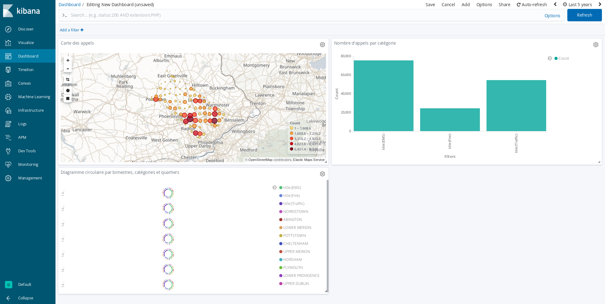

# 911 Calls avec ElasticSearch

## Import du jeu de données

Pour importer le jeu de données, complétez le script `import.js` (ici aussi, cherchez le `TODO` dans le code :wink:).

Exécutez-le ensuite :

```bash
npm install
node import.js
```

Vérifiez que les données ont été importées correctement grâce au shell (le nombre total de documents doit être `153194`) :

```
GET <nom de votre index>/_count
```

## Requêtes

À vous de jouer ! Écrivez les requêtes ElasticSearch permettant de résoudre les problèmes posés.

### Compter le nombre d'appels autour de Lansdale dans un rayon de 500 mètres

```
GET 911/_search
{
  "query": {
    "bool": {
      "must": {
        "match_all": {}
      },
      "filter": {
        "geo_distance": {
          "distance": "500m",
          "location": {
            "lat": 40.241493,
            "lon": -75.283783
          }
        }
      }
    }
  }
}
```

### Compter le nombre d'appels par catégorie

```
GET 911/_search
{
  "size": 0,
  "aggs" : {
    "callCategories" : {
      "filters" : {
        "filters" : {
          "EMS"     : { "match" : { "title" : "EMS:"     }},
          "Fire"    : { "match" : { "title" : "Fire:"    }},
          "Traffic" : { "match" : { "title" : "Traffic:" }}
        }
      }
    }
  }
}
```

### Trouver les 3 mois ayant comptabilisés le plus d'appels

```
GET 911/_search
{
  "size": 0,
  "aggs": {
    "by_month": {
      "date_histogram": {
        "field": "@timestamp",
        "interval": "month"
      },
      "aggs": {
        "month_bucket_sort": {
          "bucket_sort": {
            "sort": {"_count": "desc"},
            "size": 3
          }
        }
      }
    }
  }
}
```

### Trouver le top 3 des villes avec le plus d'appels pour overdose

```
GET 911/_search
{
  "size": 0,
  "query": {
    "bool": {
      "must": {
        "match": {"title": "OVERDOSE"}
      }
    }
  },
  "aggs" : {
    "city" : {
      "terms" : { 
        "field" : "twp.keyword",
        "size" : 3
      }
    }
  }
}
```

## Kibana

Dans Kibana, créez un dashboard qui permet de visualiser :

* Une carte de l'ensemble des appels
* Un histogramme des appels répartis par catégories
* Un Pie chart réparti par bimestre, par catégories et par canton (township)

Pour nous permettre d'évaluer votre travail, ajoutez une capture d'écran du dashboard dans ce répertoire [images](images).

Capture d'écran de notre dashboard :



### Timelion
Timelion est un outil de visualisation des timeseries accessible via Kibana à l'aide du bouton : 

Réalisez le diagramme suivant :


Envoyer la réponse sous la forme de la requête Timelion ci-dessous:  

```
TODO : ajouter la requête Timelion ici

.es('title:Fire AND @timestamp: [2016-07-08 TO 2017-01-08]').cusum().label("Last 6 months of 'Fire' calls"),
.es('title:Fire AND @timestamp: [2016-01-08 TO 2016-07-07]', offset=-6M).cusum().label("Previous 6 months of 'Fire' calls"),
.static(6200).label(Objective).lines(fill=1)
```
